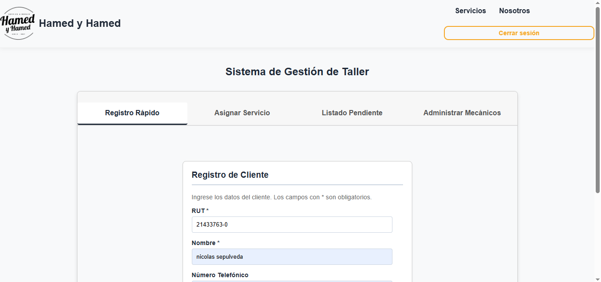

# 🔧 Sistema de Gestión para Taller Mecánico (Full-Stack Web App)

Aplicación web integral diseñada para digitalizar y optimizar la operativa diaria de un taller mecánico automotriz. Permite administrar el ingreso de clientes y vehículos, la asignación dinámica de mecánicos y el seguimiento de órdenes de trabajo en tiempo real mediante una interfaz intuitiva conectada a una API REST modular.

<!-- Reemplaza con el enlace a tu frontend desplegado si ya lo tienes -->
🚀 **Demo en vivo:** [https://tu-proyecto.vercel.app](https://tu-proyecto.vercel.app)

<!-- Badges de tecnologías -->
[](https://developer.mozilla.org/es/docs/Web/HTML)
[](https://developer.mozilla.org/es/docs/Web/CSS)
[](https://developer.mozilla.org/es/docs/Web/JavaScript)
[](https://nodejs.org/)
[](https://expressjs.com/)
[](https://www.mysql.com/)
[](https://zod.dev/)
[](https://jwt.io/)

---

### 📸 Vistas de la Aplicación

| Landing Page Pública | Acceso y Gestión Interna |
| :---: | :---: |
|  |  |

---

## 📌 Contexto y Solución

La administración en talleres pequeños suele depender de registros físicos o planillas manuales, provocando fallas de trazabilidad, demoras en diagnósticos y desorganización en el reparto de tareas del equipo técnico.

Este sistema soluciona dicha problemática mediante una **arquitectura desacoplada (Frontend + API REST)**:
- Una interfaz accesible desarrollada en **HTML5, CSS3 y JavaScript** para que el personal del taller gestione la operación sin fricciones.
- Un backend seguro y validado que asegura la persistencia y la integridad de los datos operacionales en MySQL.

---

## ✨ Características Principales

- **Panel de Control (Dashboard):** Vista consolidada de vehículos en espera, trabajos en progreso y disponibilidad de mecánicos.
- **Gestión de Vehículos y Clientes:** Altas, bajas y modificaciones con validación de identificadores/patentes y datos de contacto.
- **Asignación de Reparaciones:** Creación de órdenes de trabajo asociadas a mecánicos específicos con estados configurables (Ingresado, En Proceso, Finalizado).
- **Validación de Datos en Ambos Extremos:** Validaciones dinámicas en el cliente para una respuesta ágil de la interfaz y esquemas con **Zod** en el servidor para máxima integridad.
- **Seguridad y Sesiones:** Manejo de sesiones seguras mediante JSON Web Tokens (JWT) y hashing de contraseñas con `bcrypt`.

---

## 🛠️ Stack Tecnológico

### Frontend
- **Lenguajes:** HTML5, CSS3, JavaScript (Vanilla ES6+)
- **Consumo de API:** Fetch API / peticiones asíncronas (`async/await`)
- **Despliegue:** Vercel

### Backend
- **Entorno de ejecución:** Node.js
- **Framework web:** Express.js
- **Base de Datos:** MySQL
- **Validación de esquemas:** Zod
- **Seguridad:** JWT (JSON Web Tokens), Bcrypt
- **Arquitectura:** Patrón en capas modular (Rutas, Controladores, Modelos, Validaciones)

---

## 🔑 Credenciales de Prueba (Demo Access)

Para facilitar la evaluación y navegación dentro del portal privado (`Acceso Mecánicos`), se pueden utilizar los siguientes usuarios precargados en el entorno de pruebas:

| Rol | Correo / Usuario | Contraseña | Permisos / Alcance |
| :--- | :--- | :--- | :--- |
| **Administrador** | `admin@taller.com` | `admin1234` | Gestión global, registro de mecánicos, asignación y vista de órdenes |
| **Mecánico** | `juan.perez@gmail.com` | `JuanPassword1` | Vista y asignacion de órdenes asignadas y actualización de estados |
---

## 🔒 Reglas de Validación y Manejo de Errores (Zod)

El backend implementa un tipado estricto mediante esquemas de **Zod** para blindar la base de datos contra entradas inconsistentes o inseguras:

* **Política de Contraseñas Seguras:** Al registrar un nuevo mecánico o usuario, el esquema exige estrictamente:
  - Longitud entre **8 y 50 caracteres**.
  - Al menos una letra **mayúscula** (`A-Z`).
  - Al menos una letra **minúscula** (`a-z`).
  - Al menos un **número** (`0-9`).
* **Diagnóstico de Errores (Dev Note):** Si una solicitud no cumple con estos parámetros, el backend responde con un código `400 Bad Request` y un arreglo JSON con los mensajes descriptivos definidos en el esquema. Para inspeccionar el campo exacto rechazado mientras se implementa el feedback visual directo en los inputs del formulario, revisar la pestaña **Red (Network) -> Response** en las herramientas de desarrollo del navegador (`F12`).
---

## 📂 Estructura del Repositorio

### 🖥️ Frontend

```text
frontend/
├── index.html                     # Landing page principal
├── css/
│   ├── estilos.css                # Reglas y estilos base
│   ├── inicio.css                 # Estilos específicos de la landing
│   ├── login.css                  # Estilos para el formulario de login
│   └── vista_taller_mecanico.css  # Estilos para la plataforma del taller
├── html/
│   ├── login.html                 # Vista de autenticación para mecánicos
│   ├── vista_cliente.html         # Vista para seguimiento del cliente
│   └── vista_taller_mecanico.html # Panel principal operativo del taller
├── imagenes/
│   ├── imagen-auto.png
│   ├── logo-hamed-y-hamed-negro.png
│   └── mejorar-taller-mecanico.jpg
└── js/
    ├── api.js                     # Configuración de peticiones al backend
    ├── cliente.js                 # Lógica de interacción para clientes
    ├── conexion.js                # Manejo de estado de conexión
    ├── consulta.js                # Búsquedas y consultas de datos
    ├── formulario.js              # Captura y validaciones de formularios
    ├── login.js                   # Gestión de login y almacenamiento de token
    ├── notificaciones.js          # Feedback visual y alertas al usuario
    ├── registrar-mecanico.js      # Formulario de alta de nuevo personal
    ├── servicios.js               # Catálogo e interacción con servicios
    ├── tabs.js                    # Control de navegación por pestañas
    ├── validar-patente.js         # Validación de formato de patente chilena
    ├── validar-rut.js             # Validación y cálculo de dígito verificador RUT
    ├── vehiculos.js               # Manejo de CRUD e historial de vehículos
    └── vistas.js                  # Control de visibilidad y renderizado dinámico
```
### ⚙️ Backend

```text
backend/
├── backend.js                                 # Entrada y configuración principal del servidor Express
├── conexionDB.js                              # Configuración del pool de conexión a MySQL
├── bases de datos/
│   └── base-de-datos.SQL                      # Script DDL de tablas, relaciones y datos semilla
├── controllers/
│   ├── auth.controller.js                     # Autenticación, login y generación de JWT
│   ├── autos.controller.js                    # CRUD e inventario de vehículos
│   ├── clientes.controller.js                 # Gestión de clientes y contacto
│   ├── consulta-vehiculo.controller.js        # Búsqueda y trazabilidad por patente/RUT
│   ├── estado-vehiculo.controller.js          # Control de estados de reparación en taller
│   ├── mecanicos.controller.js                # Gestión y registro del equipo técnico
│   ├── servicios-mecanicos.controller.admin.js # Asignación y métricas de órdenes (Admin)
│   ├── servicios-mecanicos.controller.js      # Asociación entre servicios y mecánicos
│   └── servicios.controller.js                # Catálogo de servicios mecánicos disponibles
├── middlewares/
│   ├── error.middleware.js                    # Manejo centralizado de excepciones y respuestas HTTP
│   ├── validarSchema.middleware.js            # Validación de payloads mediante esquemas Zod
│   └── verificarToken.middleware.js           # Validación y decodificación de tokens JWT
├── routes/
│   ├── auth.routes.js                         # Endpoints de autenticación (/login, /register)
│   ├── autos.routes.js                        # Endpoints de administración de vehículos
│   ├── clientes.routes.js                     # Endpoints para operaciones de clientes
│   ├── consulta-vehiculo.routes.js            # Endpoints de consulta pública/cliente
│   ├── estado-vehiculo.routes.js              # Endpoints para actualización de estados
│   ├── mecanicos.routes.js                    # Endpoints para gestión de mecánicos
│   ├── servicios-mecanicos.routes.js          # Endpoints de órdenes de trabajo y asignaciones
│   └── servicios.routes.js                    # Endpoints del catálogo de servicios
└── schemas/
    ├── autos.schemas.js                       # Esquemas Zod para datos de vehículos
    ├── clientes.schemas.js                    # Esquemas Zod para registro y datos de clientes
    ├── mecanicos.schemas.js                   # Esquemas Zod para credenciales y perfil técnico
    ├── servicios-mecanicos.schemas.js         # Esquemas Zod para asignación de reparaciones
    └── servicios.schemas.js                   # Esquemas Zod para validación de servicios